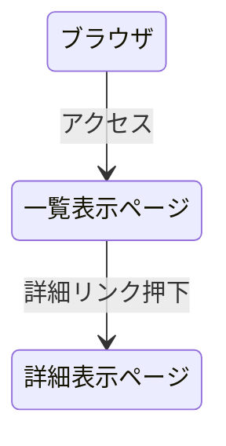

# 開発者用仕様書（仮）

## 概要
本システムは，Node.jsおよびExpressフレームワークを用いて構築された．データ一覧を表示するためのWebアプリケーションである．
サーバ側で管理されているデータ群を読み込み，HTMLとしてレンダリングしてクライアントに提供することを目的とする．
##　データ構造

###　データモデル
| 項目名 | データ型 | 説明 |
| :--- | :--- | :--- |
| **id** | Integer | データを一意に識別するためのID |
| **name** | String | 表示対象の名称 |
| **value** | Integer/String | データに関連する値 |

### データ例
```C
[
  { "id": 1, "name": "Item A", "value": 100 },
  { "id": 2, "name": "Item B", "value": 200 },
  { "id": 3, "name": "Item C", "value": 300 }
]
```
## ページ遷移

###　画面遷移図



## リソースごとの機能の詳細

### 一覧表示ページ
- エンドポイント
- HTTPメソッド
- 機能概要
サーバに保存されているデータ配列をすべて取得する.

- HTML構成

### 詳細表示ページ
- エンドポイント
- HTTPメソッド
- 機能概要
一覧ページから選択された特定のデータの詳細情報を表示する.